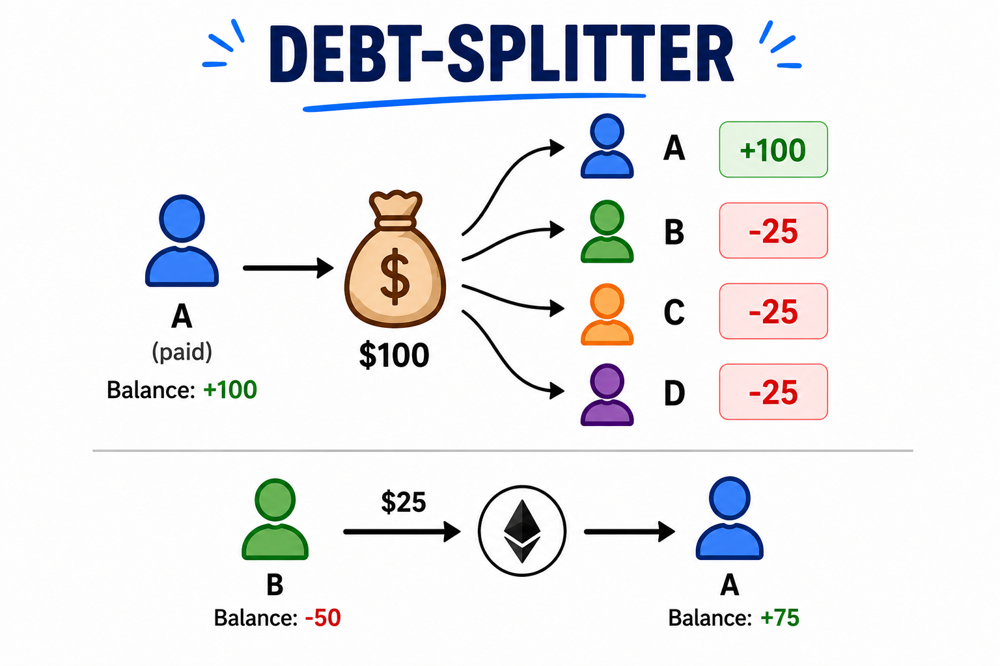

# ⛓️ Block Splitter

> On-chain expense splitting for groups of people — track, split, and settle debts directly on Ethereum.


## 🌟 Highlights

- **Trustless** — no backend, no server, expenses and debts live on-chain
- **Group factory** — deploy isolated expense groups in one transaction
- **Smart debt minimization** — greedy two-pointer algorithm reduces the number of payments needed
- **Pay in one shot** — `payAll()` settles all your debts atomically in a single ETH transaction
- Built with **Foundry** + **Scaffold-ETH 2** (Next.js frontend)

## ℹ️ Overview

Block Splitter is a decentralized version of Splitwise. Any user can create a group, add members, record expenses, and let the contracts compute who owes what. When it's time to settle, members send ETH directly to their creditors — no intermediary, no custody.

The core logic lives in two contracts:

- **`RegistryGroups`** — factory that deploys and indexes `Group` contracts
- **`Group`** — tracks member balances, computes debts via a greedy algorithm, and handles ETH settlement

## 📐 Contract Architecture

El proyecto usa un patrón factory con tres contratos:

```
RegistryGroups  (factory + registro global)
  ├── despliega instancias de Group
  └── mantiene una instancia compartida de Utils

Group           (lógica por grupo)
  ├── addExpense(payer, amount)
  ├── split()
  ├── payAll()  { payable }
  └── stubs V2: addMember, pay, leaveGroup, dissolveGroup

Utils           (helpers sin estado, desplegado una sola vez)
  ├── abs(int256) → uint256
  └── isSorted / isSortedDesc
```



### Modelo de balances

Cada miembro tiene un balance `int256`:

- **Positivo** → es acreedor (le deben dinero)
- **Negativo** → es deudor (debe dinero)
- **Cero** → está al día

Cuando se registra un gasto con `addExpense(payer, amount)`, el costo se divide equitativamente entre todos los miembros (`amount / totalMembers`). El residuo de la división entera queda en favor del pagador (rounding estándar, sin wei perdidos en el contrato).

### Algoritmo de deudas (`split` → `getDebts`)

`split()` agrupa a los miembros en deudores (balance < 0) y acreedores (balance ≥ 0) y llama a `getDebts()`, que aplica un algoritmo greedy de dos punteros para minimizar el número de transferencias necesarias. El ordenamiento descendente por balance absoluto se realiza **off-chain** (responsabilidad del caller) para mantener el gas bajo.

### Liquidación con `payAll`

`payAll()` es `payable` y exige que `msg.value` sea exactamente igual al total adeudado por el caller. Itera sobre el array de deudas, transfiere ETH directamente a cada acreedor vía `.call{value}()` y actualiza los balances en el mismo bloque. No se admiten pagos parciales en V1.

---

## 🚀 Quickstart

**Requirements:** Node >= 18, Yarn, Git, [Foundryup](https://book.getfoundry.sh/getting-started/installation)

> **Windows users:** use WSL — Foundryup is not supported on Powershell or Git Bash.

```bash
# 1. Install dependencies
yarn install

# 2. Start a local chain
yarn chain

# 3. Deploy contracts
yarn deploy

# 4. Start the frontend
yarn start
```

Open [http://localhost:3000](http://localhost:3000) to see the app.

## ⬇️ Contract usage

```solidity
// Create a group
registryGroups.createGroup([alice, bob, carol]);

// Record an expense (any member can call this)
group.addExpense(alice, 120 ether);

// Compute debts
group.split();

// Settle all your debts in one tx (send exact ETH owed)
group.payAll{ value: 50 }();
```

## 🧪 Tests

```bash
cd packages/foundry
forge test          # run all tests
forge test -vvv     # verbose output
forge coverage      # coverage report
```

### Coverage

| Contract | Lines | Statements | Branches | Functions |
|---|---|---|---|---|
| `Group.sol` | 92.59% | 98.95% | 82.61% | 58.33% |
| `RegistryGroups.sol` | 100.00% | 100.00% | 100.00% | 100.00% |
| `Utils.sol` | 27.27% | 17.65% | 25.00% | 33.33% |
| **Total** | **86.14%** | **87.70%** | **74.07%** | **58.82%** |

> `Utils.sol` coverage is low because `isSorted` / `isSortedDesc` helpers don't have dedicated tests yet. `Group.sol` function coverage reflects stub functions (`addMember`, `pay`, `leaveGroup`, `dissolveGroup`) pending V2 implementation.

## ✍️ Author

Built by [@sh4dex](https://github.com/sh4dex) using [Scaffold-ETH 2](https://github.com/scaffold-eth/scaffold-eth-2) as the project base.
